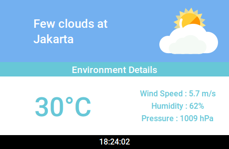
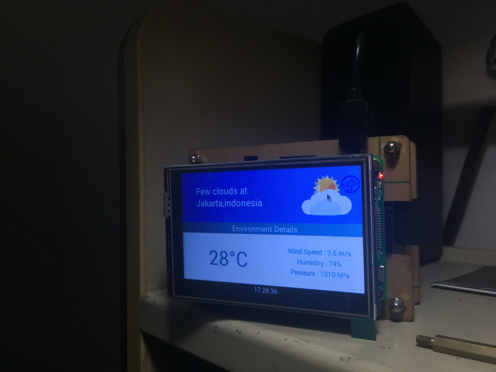

# piWeatherman ☁️

Raspberry Pi Weather Station (No sensors required)



## About This

I wanted to create a Weather Station for my Raspberry Pi. I started tinkering with sensors, but then I realized that "Why not just use an API?" and so I did. I used [OpenWeatherMap API](https://openweathermap.org/) to power this application.

Of course, if you wanted to work with sensors, go ahead and make adjustments to the script. The GUI is ready you just need to plug in the sensors and get it running.

Great Source : https://www.raspberrypi.org/learning/sensing-the-weather/

## Try It Out!

Lets try this application out shall we, first thing you need is an Operating System running on your Raspberry PI. I suggest [Raspbian OS](https://www.raspberrypi.org/downloads/raspbian/). Then make sure its plugged in to a Display and Power it up.

You also need [Python](https://python.org/) Installed, If you are using Raspbian, You already have it installed on your system. Lets just update your system if it hasn't been updated in a while.

```bash
$ sudo apt update
$ sudo apt upgrade
```

Once that is done, type in this command to download piWeatherman from GitHub.

```bash
$ git clone https://github.com/abhishtagatya/piWeatherman
$ cd piWeatherman
```

Now you are in the piWeatherman directory, now we are going to install some of the dependencies and requirements.

```bash
$ sh install.sh
```

You are then greeted with a Registration Form, just fill it in and make sure to get your API Key from [OpenWeatherMap](https://openweathermap.org/api) and your locality.

For example : Jakarta, Indonesia

Enjoy your awesome weather station! Here is mine :



## To Do List

If you want to contribute awesome features to this, here is a great starting point I could need help with!

- [ ] Response and Fluid GUI for larger screens
- [ ] Add GUI Preferences and quick changes
- [ ] Change day and night mode to fit sunrise and sunset from OpenWeatherAPI
- [ ] Implement Weather Teleprompter to display   commentaries about Weather (commentaries includes : Jokes, Advice, Greetings and More)
- [ ] Add Sliding Windows to display multiple cities and features
- [ ] Forecast Historical Data (Display history and predictions of previous and future weather)
- [ ] News Caster GUI (Display header and text of daily news)
- [ ] Timezone GUI (Display time of different areas)
- [ ] Easy Implementation of the Weather Sensor (Users can choose / switch between API and Sensors in the Start of the program)
- [ ] Clean Up code clutters and unused variables

## Authors

- Abhishta Gatya - Initial Work

## License

This project is licensed under the MIT License - see the [LICENSE](https://github.com/abhishtagatya/piWeatherman/blob/master/LICENSE) for details
